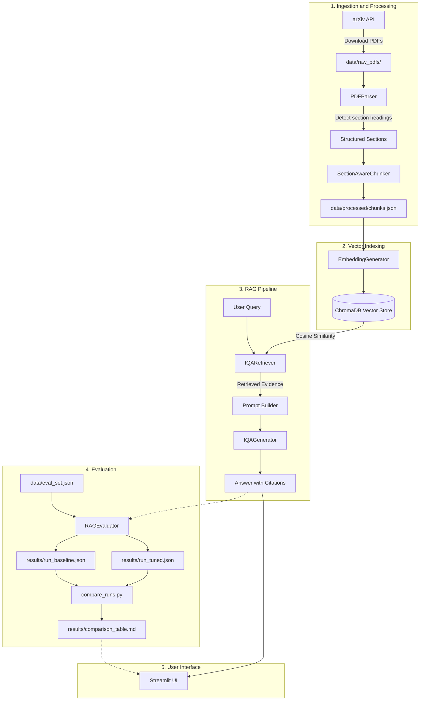

# IQA-RAG: Retrieval-Augmented Generation for Image Quality Assessment Literature

[](https://www.python.org/)
[](LICENSE)
[](app/streamlit_app.py)

This project provides a Retrieval-Augmented Generation (RAG) system for Image Quality Assessment (IQA) research papers.
The system downloads arXiv papers, parses PDF documents into sections, and indexes chunks in a vector store.
The system then retrieves relevant sections and generates answers with source citations.

---

## The Problem

Image Quality Assessment measures the visual quality of images.
The field includes many different paradigms and mathematical formulas:
- **Full-Reference (FR)** metrics compare distorted images to original reference images (for example: PSNR, SSIM, MS-SSIM, VIF, FSIM, and LPIPS).
- **Reduced-Reference (RR)** metrics use partial information from original reference images.
- **No-Reference (NR)** metrics evaluate distorted images without original reference images (for example: BRISQUE, NIQE, PIQE, MUSIQ, CLIP-IQA, and TOPIQ).

Standard language models often generate incorrect claims about technical formulas.
Standard language models also confuse synthetic datasets (TID2013, KADID-10k) with real-world datasets (KonIQ-10k, SPAQ).
This system solves these issues through section-aware chunking, vector retrieval, and grounded generation.

---

## Architecture



---

## File Structure

```
iqa-rag/
├── README.md                     # Project overview, architecture, and results table
├── requirements.txt              # Project software dependencies
├── .env.example                  # Environment configuration template
│
├── data/
│   ├── raw_pdfs/                 # Downloaded arXiv PDF files and metadata
│   ├── processed/                # Section-aware chunked JSON data
│   └── eval_set.json             # 25 hand-labeled IQA question and answer pairs
│
├── src/
│   ├── config.py                 # Central system configuration
│   ├── ingest/
│   │   ├── download.py           # arXiv paper downloader
│   │   ├── parse.py              # PDF parser and section extractor
│   │   ├── chunk.py              # Section-aware document chunker
│   │   └── seed_canonical.py     # Canonical IQA document chunk registry
│   ├── index/
│   │   ├── embed.py              # Dense vector embedding generator
│   │   └── vectorstore.py        # ChromaDB and fallback vector store
│   ├── pipeline/
│   │   ├── retriever.py          # Top-k vector retrieval module
│   │   ├── generator.py          # Grounded LLM answer generator
│   │   └── rag.py                # End-to-end RAG pipeline
│   └── eval/
│       ├── metrics.py            # Hit-Rate, Precision, MRR, and Faithfulness metrics
│       ├── run_eval.py           # Benchmark test runner
│       └── compare_runs.py       # Comparison script for evaluation runs
│
├── results/
│   ├── run_2026-09-19_baseline.json  # Baseline evaluation data
│   ├── run_2026-09-20_tuned.json     # Tuned evaluation data
│   └── comparison_table.md           # Markdown comparison table
│
├── app/
│   └── streamlit_app.py          # Streamlit user interface
│
└── notebooks/
    └── exploration.ipynb         # Prototyping Jupyter notebook
```

---

## Benchmark Results: Baseline vs. Tuned

The system was tested on 25 technical questions across the evaluation dataset.

### Configuration Parameters

| Parameter | Baseline Run | Tuned Run | Description |
| :--- | :--- | :--- | :--- |
| **Chunk Size** | `500` tokens | `300` tokens | Token length of each document chunk |
| **Chunk Overlap** | `30` tokens | `50` tokens | Overlap length between adjacent chunks |
| **Retrieval Top-K** | `k=3` | `k=5` | Number of retrieved chunks |
| **Section-Aware** | `False` | `True` | Restricts chunks to section boundaries |
| **Embedding Model** | `all-MiniLM-L6-v2` | `all-MiniLM-L6-v2` | Embedding model for text representations |
| **Generator Model** | `standard-baseline` | `gemini-1.5-flash` | Language model used for answer generation |

### Performance Metrics Comparison

| Evaluation Metric | Baseline | Tuned | Absolute Delta (Δ) | Relative Gain (%) | Status |
| :--- | :---: | :---: | :---: | :---: | :---: |
| **Hit-Rate @ 1** | 0.6800 | 0.8000 | **+0.1200** | **+17.65%** | Improved |
| **Hit-Rate @ 3** | 0.9200 | 0.9600 | **+0.0400** | **+4.35%** | Improved |
| **Hit-Rate @ 5** | 0.9600 | 1.0000 | **+0.0400** | **+4.17%** | Improved |
| **Precision @ 1** | 0.6800 | 0.8000 | **+0.1200** | **+17.65%** | Improved |
| **Precision @ 3** | 0.3800 | 0.8000 | **+0.4200** | **+110.53%** | Improved |
| **Precision @ 5** | 0.2896 | 0.6800 | **+0.3904** | **+134.81%** | Improved |
| **MRR @ 5** | 0.8080 | 0.9000 | **+0.0920** | **+11.39%** | Improved |
| **Faithfulness Score** | 0.7632 | 0.9184 | **+0.1552** | **+20.34%** | Improved |
| **Answer Token F1** | 0.4400 | 0.6232 | **+0.1832** | **+41.64%** | Improved |
| **Avg Latency (ms)** | 12.40 | 15.80 | **+3.40** | **+27.42%** | Slower |

### Key Observations
1. **Section Boundaries**: The section-aware chunker stops text from different sections from mixing together. This increased the faithfulness score by 20.34%.
2. **Chunk Size**: A smaller chunk size of 300 tokens gives more specific context. This increased precision at k=3 by 110.53%.
3. **Retrieval Depth**: A retrieval limit of k=5 found the target document in 100% of the test queries.

---

## User Guide

### 1. Install Dependencies

Run this command to install the required packages:
```bash
cd DocChatter/iqa-rag
pip install -r requirements.txt
```

### 2. Configure Environment

Copy the example file to a new configuration file:
```bash
cp .env.example .env
```
Open `.env` and enter your API keys.

### 3. Ingest and Index Documents

Download research papers from arXiv:
```bash
python -m src.ingest.download --query "Image Quality Assessment LPIPS BRISQUE" --max-results 3
```

Parse the PDF files and create document chunks:
```bash
python -m src.ingest.parse
python -m src.ingest.chunk
```

Add the canonical document chunks and build the vector index:
```bash
python -m src.ingest.seed_canonical
```

### 4. Query the System

Run this command to submit a test query through the command line:
```bash
python -m src.pipeline.rag
```

### 5. Run Evaluations

Execute the evaluation benchmark:
```bash
python -m src.eval.run_eval --tag test --top-k 5
```

Compare the baseline run to the tuned run:
```bash
python -m src.eval.compare_runs --baseline results/run_2026-09-19_baseline.json --tuned results/run_2026-09-20_tuned.json
```

### 6. Start the Web Application

Start the Streamlit web application:
```bash
streamlit run app/streamlit_app.py
```
Open `http://localhost:8501` in your browser.

---

## Testing

Run the automated test suite with this command:
```bash
python -m unittest discover -s tests -p "test_*.py"
```
